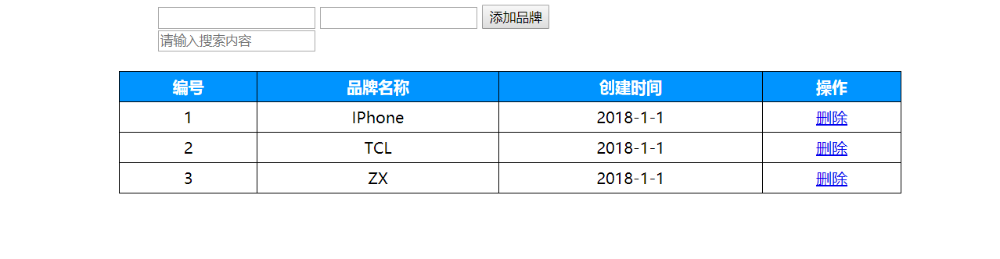
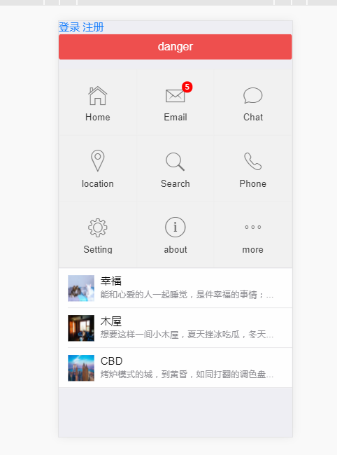

### Vue 的学习
#### 1 MVVM模式
- MVVM拆分解释为：
    - Model:负责数据存储
    - View:负责页面展示
    - View Model:负责业务逻辑处理（比如Ajax请求等），对数据进行加工后交给视图展示
    
- MVVM要解决的问题是将业务逻辑代码与视图代码进行完全分离，使各自的职责更加清晰，后期代码维护更加简单

- 用图解的形式分析Ajax请求回来数据后直接操作Dom来达到视图的更新的缺点，以及使用MVVM模式是如何来解决这个缺点的


#### 2 指令的综合应用实例
- 代码如下：
```html
<!DOCTYPE html>
<html lang="en">

<head>
    <meta charset="UTF-8">
    <meta name="viewport" content="width=device-width, initial-scale=1.0">
    <meta http-equiv="X-UA-Compatible" content="ie=edge">
    <title>Vue Directive Learning</title>
    <link rel="stylesheet" type="text/css" media="screen" href="../dist/css/main.css" />
    <script src="../dist/js/v1/vue.js"></script>
</head>

<body>
    <div id="app">
        <div class="opearea">
            <input type="text" v-model="productId" />
            <input type="text" v-model="productName" @keydown.enter="addProduct" />
            <button @click="addProduct">添加品牌</button>
            <div>
                <input type="text" placeholder="请输入搜索内容" v-model="searchVal" />
            </div>
        </div>
        <table class="list">
            <tr>
                <th>编号</th>
                <th>品牌名称</th>
                <th>创建时间</th>
                <th>操作</th>
            </tr>
            <tr v-if="list.length == 0">
                <td colspan="4">当前列表无数据</td>
            </tr>
            <tr v-for="item in list | filterBy searchVal in 'name'" track-by="$index">
                <td>{{item.id}}</td>
                <td>{{item.name}}</td>
                <td>{{item.ctime | datefmt '-'}}</td>
                <td>
                    <a href="javascript:void(0);" @click="del(item.id);">删除</a>
                </td>
            </tr>
        </table>
    </div>
    <script>
        var vm = new Vue({
            el: "#app",
            data: {
                list: [{
                    id: 1,
                    name: 'IPhone',
                    ctime: new Date()
                }, {
                    id: 2,
                    name: 'TCL',
                    ctime: new Date()
                }],
                productId: null,
                productName: '',
                searchVal: ''
            },
            methods: {
                del: function(id) {
                    if (!confirm('您真的要删除数据么？')) {
                        return;
                    }
                    /** 查找对应的元素 **/
                    var index = this.list.findIndex(function(obj) {
                        return obj.id == id;
                    });
                    /** 删除元素 **/
                    this.list.splice(index, 1);
                },
                addProduct: function() {
                    var productObj = {
                        id: this.productId,
                        name: this.productName,
                        ctime: new Date()
                    };
                    /** 添加到数组中 **/
                    this.list.push(productObj);
                    /** 初始化数据 **/
                    this.productId = null;
                    this.productName = '';
                }
            },
            filters: {
                /** 自定义全局指令 :定义在 VM中的filters对象中的所有过滤器都是私有过滤器 **/
                datefmt: function(input, spliceChar) {
                    var date = new Date(input);
                    var year = date.getFullYear();
                    var m = date.getMonth() + 1;
                    var d = date.getDate();
                    var fmtStr = year + spliceChar + m + spliceChar + d;
                    return fmtStr;
                }
            }
        });
    </script>
</body>

</html>
```

- 展示结果



- Vue-DevTools源码安装
   + 1、https://nodejs.org/en/ 下载node.exe安装
   + 2、去https://github.com/vuejs/vue-devtools 下载到文件
   + 3、进入vue-devtools-master工程 先执行npm install再执行npm run build
   + 4、进入vue-devtools-master\shells\chrome文件夹中修改mainifest.json 中的persistant为true
   + 5、打开谷歌浏览器设置--->扩展程序-->勾选开发者模式--->加载已解压的扩展程序--->选择“vue-devtools-master\shells下的chrome”文件夹，至此恭喜已经安装成功！


- Webpack 学习后使用Mnit-ui和Mui的一个静态页面的效果



- 实战项目演练，请参考：[zrainbow](./zrainbow/ReadMe.md)


最后更新于 2018-01-21 jiangyu(JhonRain)
