# Vue移动端项目实践（代号RainBow）

## 项目效果图预览

 业余项目才开始启动还没做完，没有图片，后期再补

## 技术选型
- Vue 2.0
- Node 6.11
- NPM 3.10.10
- Webpack 1.14.0
- Mint-UI/MUI

## 项目代码结构
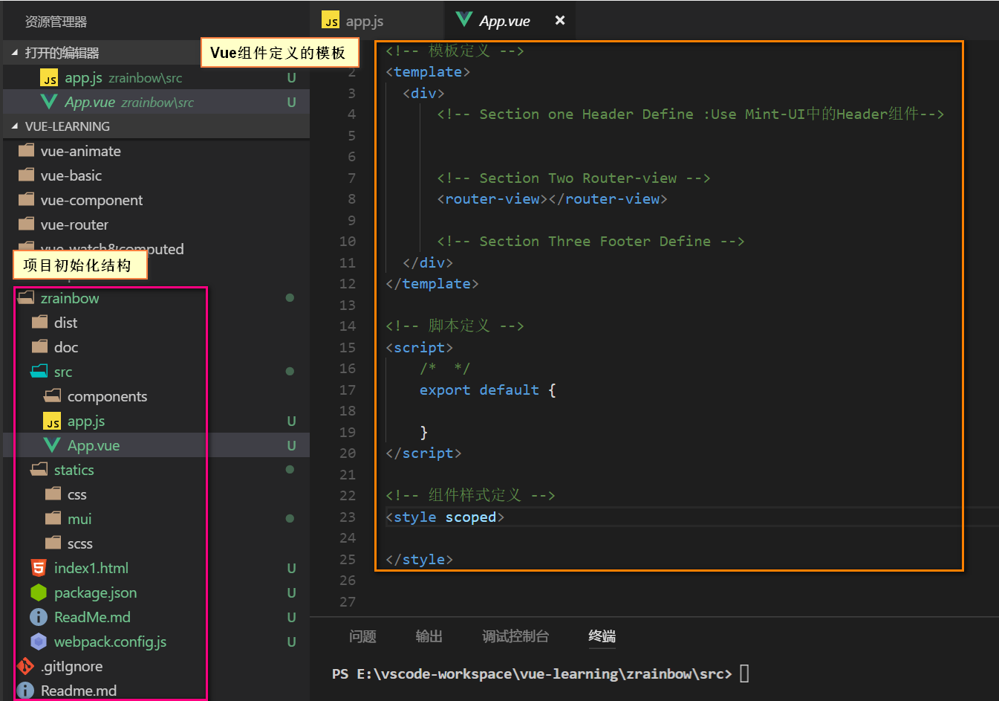

## 页面结构拆分
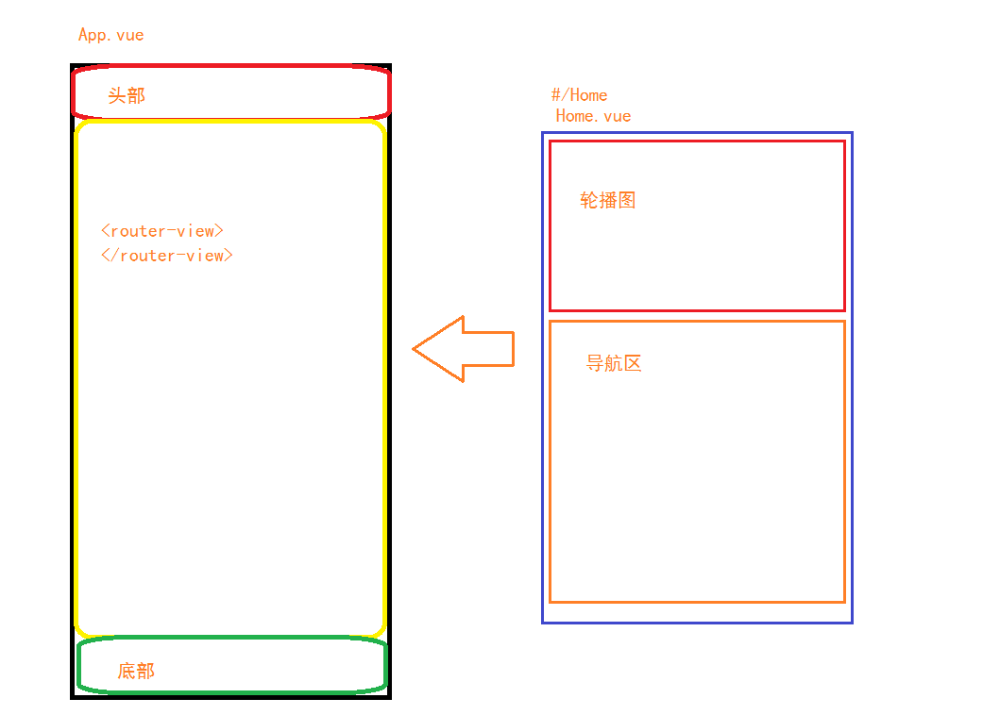

## 项目实现（TODO）
### 1.前端开发
- 1.头部和尾部的页面实现

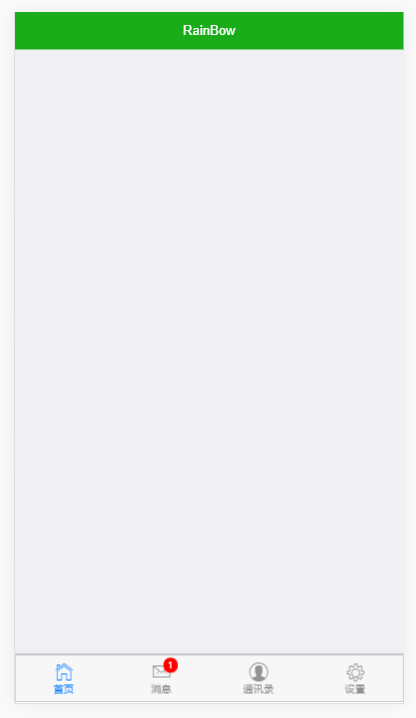
- 2.图片轮播实现

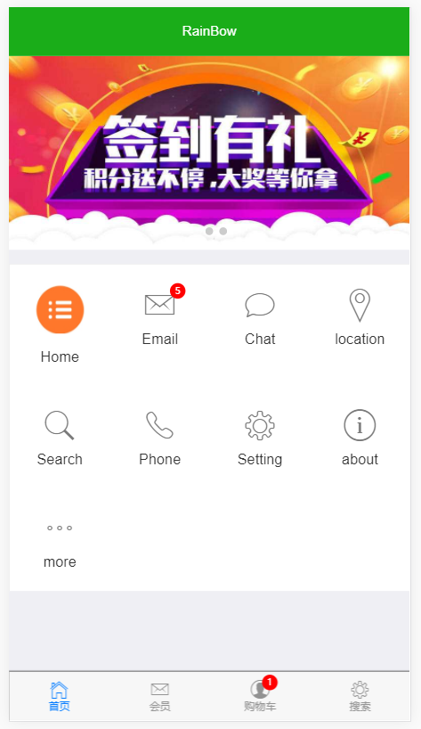

- 3.导航图标替换成自定义的图标

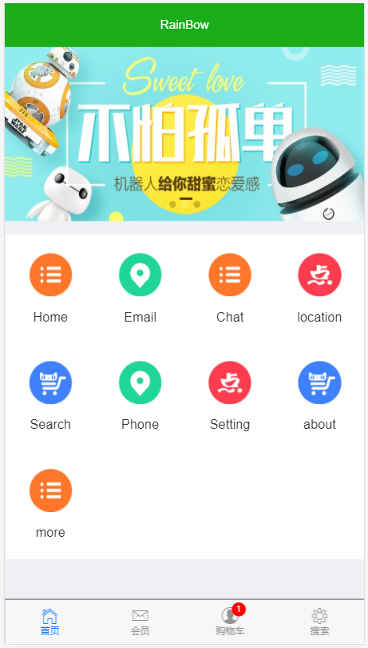

- 4.新闻资讯列表实现和全局日期格式化过滤器实现

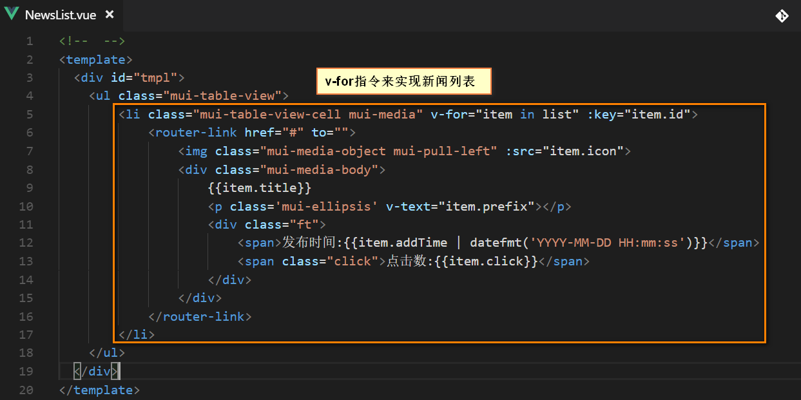

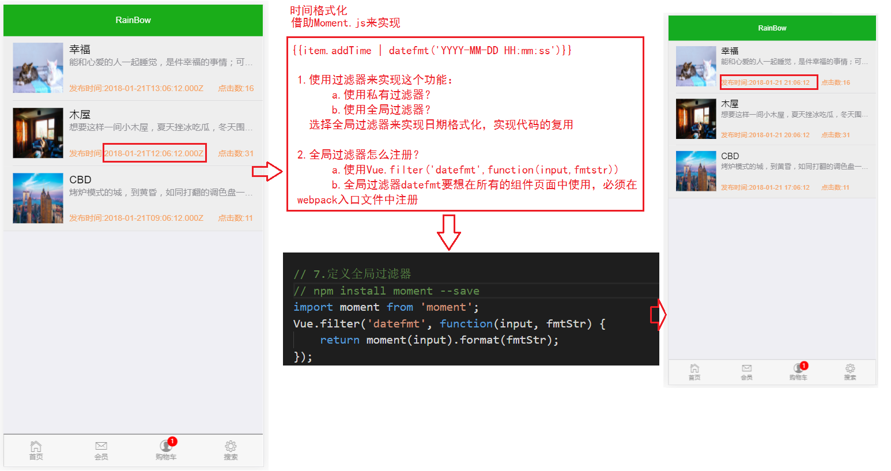

- 5.资讯详情页面实现(为了演示项目内容摘抄自[个人生活博客](https://www.jhonrain.org))

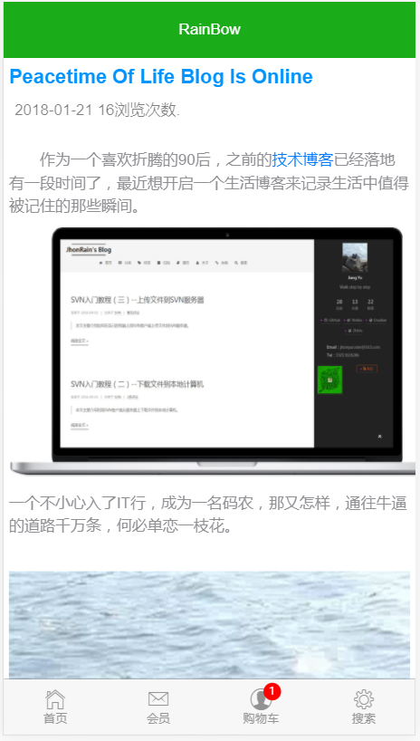

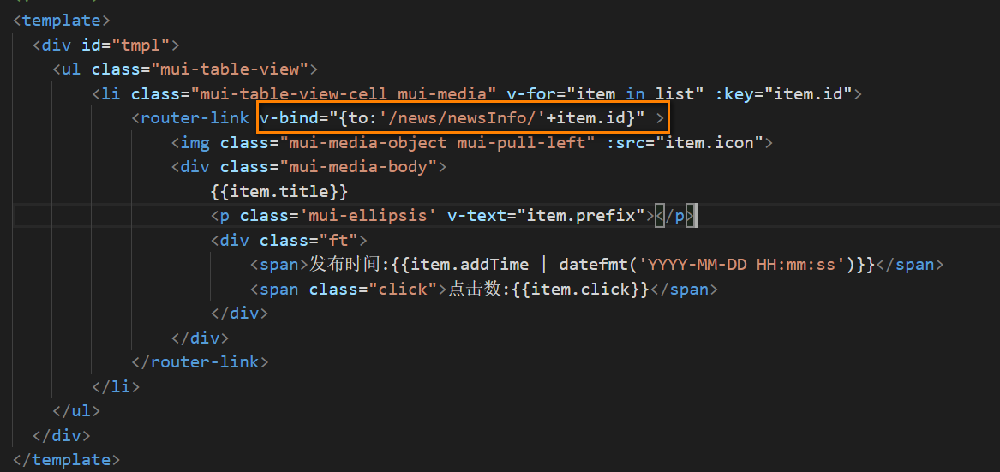

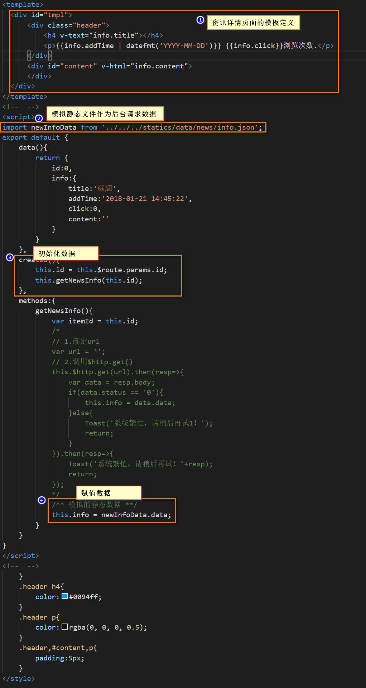

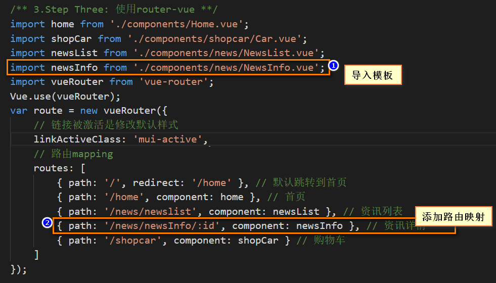

### 2.后端开发
后续再开放

## 更新日志（持续更新）
- 2018-01-20 项目开始启动，项目的初始化和结构的确定
- 2018-01-21 
    前端页面开发：
    - 1.Header部分完成
    - 2.Footer部分完成
    - 3.轮播图效果实现完成
    - 4.导航功能菜单的效果完成
    - 5.新闻资讯链接的跳转
    - 6.资讯列表展示的实现
    - 7.资讯详情页面展示实现